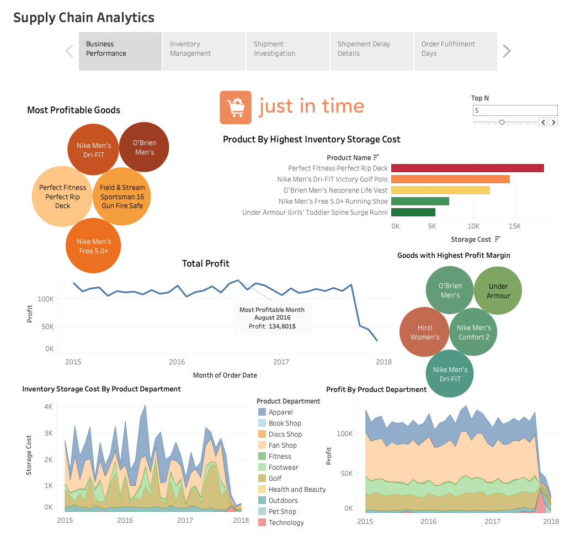

# Supply Chain Analytics — Moving from Complexity to Clarity



## Overview

An end-to-end supply chain analytics project for **Just In Time**, a retail operation facing shipment delays, inventory imbalances, and limited visibility into operational performance. I performed data preprocessing and feature engineering in Python, then built a 5-view interactive Tableau dashboard covering business performance, inventory management, shipment investigation, and order fulfillment.

**Tools:** Python (pandas, NumPy) · Tableau  
---

## Problem Statement

Just In Time lacked a unified view of supply chain performance. Key challenges included:
- No visibility into which products were overstocked vs. understocked
- No systematic tracking of shipment delays by location, product, or mode
- Profit and storage cost data scattered across disconnected sources
- Order fulfillment performance unmonitored across product categories

---

## Dataset

Three interconnected tables:

| Table | Description |
|---|---|
| `orders_and_shipments.csv` | Order details, customer info, shipment dates, product and order value |
| `inventory.csv` | Monthly warehouse inventory levels, storage costs, warehouse location |
| `fulfillment.csv` | Order fulfillment rates by product category |

---

## Data Preprocessing (Python)

**Step 1 — Data Quality Checks**
- Verified zero missing values and zero duplicates across all three tables
- Stripped leading/trailing whitespace from column names across all DataFrames
- Replaced `'-'` placeholder values in `Discount %` column with `0` and cast to float
- Cleaned special characters and encoding issues in `Customer Country` (e.g., `Dominican\xa0Republic`, `Perú`, `Cote d'Ivoire`)

**Step 2 — Feature Engineering**
- Consolidated separate year/month/day/time columns into unified `Order Datetime` and `Shipment Datetime` timestamps
- Calculated `Order Processing Time` (days from order to shipment); handled edge case where same-day shipment produced `-1` via lambda function
- Defined calculated metrics for Tableau:
  - **Storage Cost** = `Warehouse Inventory × Inventory Cost Per Unit`
  - **Shipment Delay** = `Shipment Days Actual − Shipment Days Scheduled`
  - **Profit Margin** = `Total Profit / Total Gross Sales × 100`
  - **Inventory to Sales Delta** = `Total Warehouse Inventory − Total Order Quantity`
  - **Overstock / Understock Flag** = `IF Inventory to Sales Delta > 0 THEN 'Overstock' ELSE 'Understock'`

**Step 3 — Export**
- Exported cleaned DataFrames to CSV for Tableau ingestion

---

## Tableau Dashboard (5 Views)

**1. Business Performance**
- Most profitable product departments and individual products
- Goods with highest profit margin
- Total profit trend over time (2015–2018)
- Products by highest inventory storage cost

**2. Inventory Management**
- Supply vs. demand by product department
- Most overstocked and understocked product categories
- Inventory storage cost by department over time

**3. Shipment Investigation**
- % of delayed orders overall
- Delay evolution over time
- Shipment delay by geographic location
- Most delayed products

**4. Shipment Delay Details**
- Drill-down into delay patterns by shipping mode and region

**5. Order Fulfillment Days**
- Average warehouse fulfillment days by product category

---

## Key Findings

- **Fan Shop** was consistently understocked relative to demand — a direct revenue leak
- **Perfect Fitness Rip Deck** carried the highest inventory storage cost, indicating overstock risk
- Shipment delays showed geographic clustering, pointing to specific warehouse or carrier bottlenecks
- Apparel generated the highest total profit but also carried significant storage overhead

---

## Recommendations

1. **Rebalance Fan Shop inventory** — demand consistently outpaces supply; missed sales are recoverable with targeted restocking
2. **Reduce Rip Deck overstock** — highest storage cost product; align order quantities with actual sell-through rates
3. **Investigate delay hotspots** — geographic delay clustering suggests carrier or regional warehouse issues worth auditing
4. **Promote high-margin goods** — focus discounting and seasonal campaigns on products with highest profit margins to maximize returns

---

## How to Run
Cleaned CSVs will be exported to your working directory for Tableau ingestion.

---

## Repository Structure

```
├── Supply_Chain_Analytics.ipynb   # Data preprocessing & feature engineering
├── Tableau_Dashboard.png          # Dashboard screenshot
├── README.md
```

---

*Built as part of a DataCamp supply chain analytics challenge. All preprocessing and feature metric design by Sarth Jayesh Patel.*
